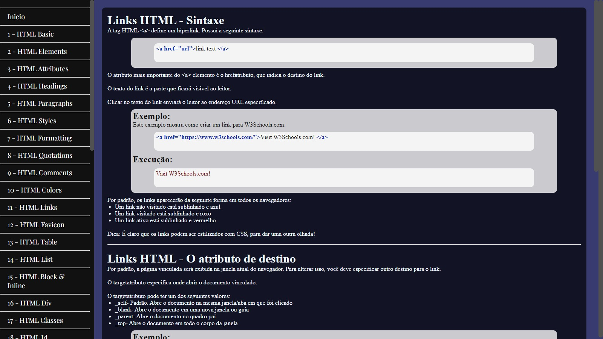
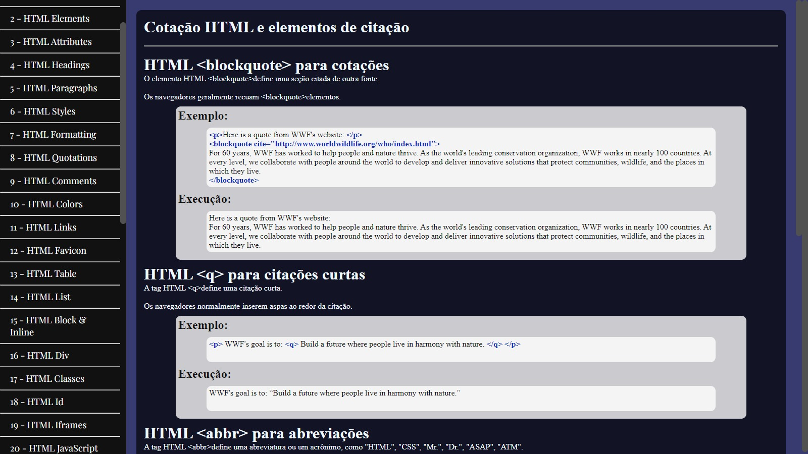
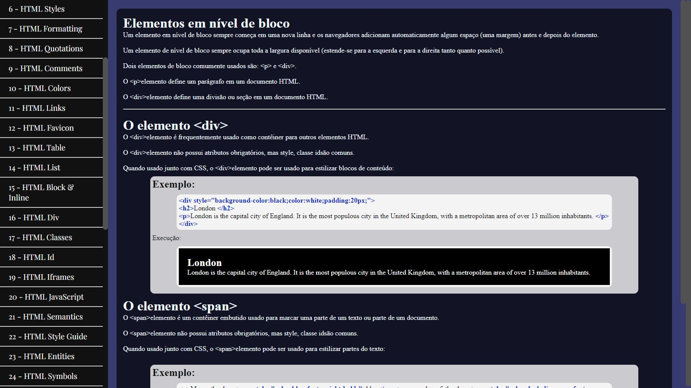

# Meu Curriculo

Um sobre HTML básico.

## 🚀 Acessando o site

<h4>Você pode acessar o site pelo link</h4> https://663568ad861482666f4e02d8--calm-yeot-bf2fa0.netlify.app

## Descrição

Um site breve sobre HTML básico para estudo.

## Imagens do site

    

 

    

 

    

 
 

## 🛠️ Construído com

Visual Studio Code utilizando HTML e CSS.

